## Time card

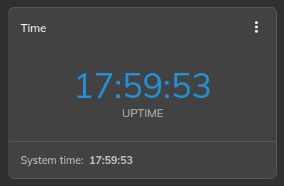

## Alerts card

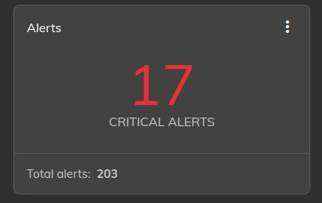

## Logs card

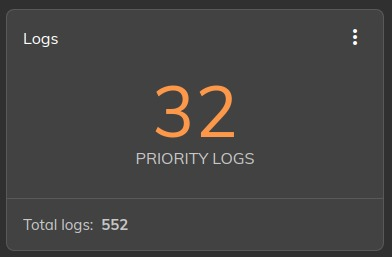

## Container versions or Deployments

## Device information

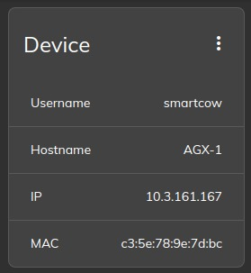

## Release details

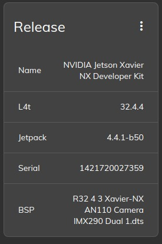

## Device temperature

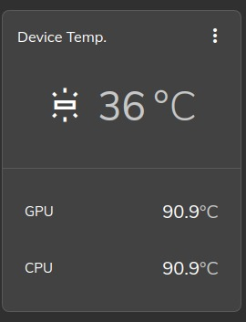

## eMMC

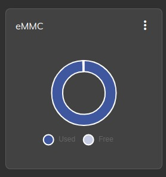

## NVME

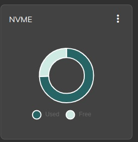

## CPU load

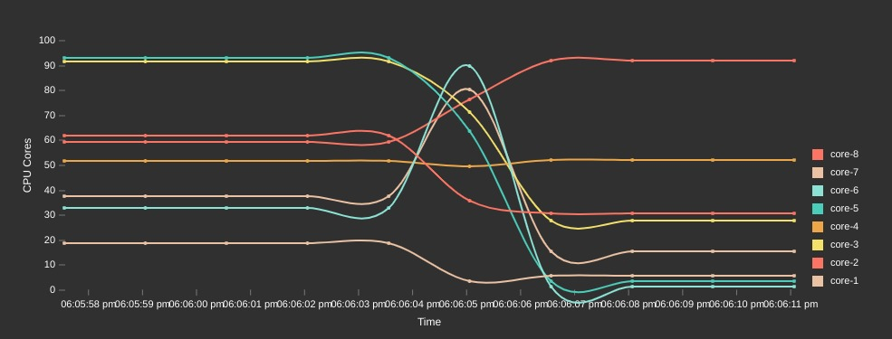

## Device load

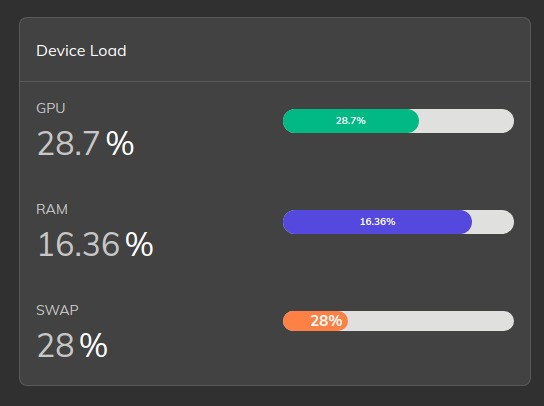

## Hardware engine

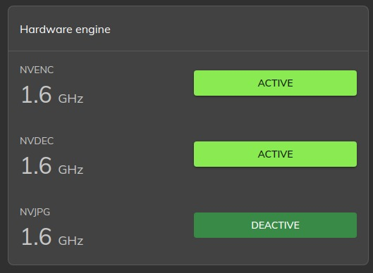

## DLA

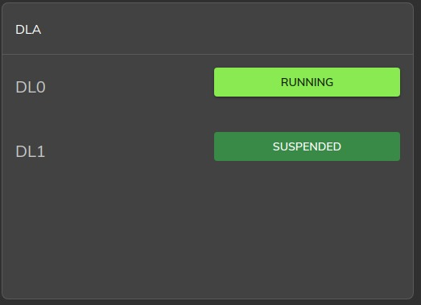

## Device location

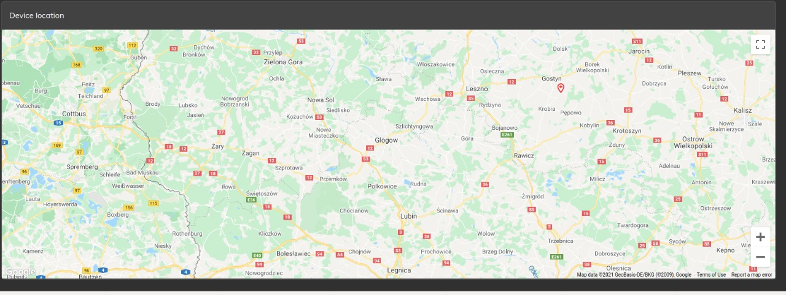
