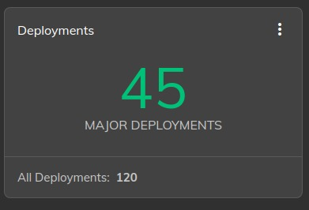

## Time card

## Alerts card

## Logs card

## Container versions or Deployments

## Device information

## Release details

## Device temperature

## eMMC

## NVME

## CPU load

## Device load

## Hardware engine

## DLA

## Device location

