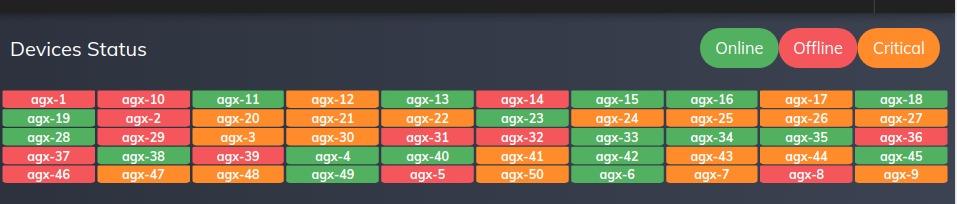

This will tells you how many devices are deployed and the status of the each device.

-   **Online**: If there is no issues with Memory, CPU, GPU and temperatures etc, the device will remain in online status that indicates green color
-   **Offline**: If there is no communication between Device and UI, we are consider this as Offline status and displayed in Red color
-   **Critical**: when issue with CPU, GPU, Memory and temperatures will consider as Critical status and marking as yellow color

The user will navigate to the Device detailed statistics page when clicking on that particular status button.
